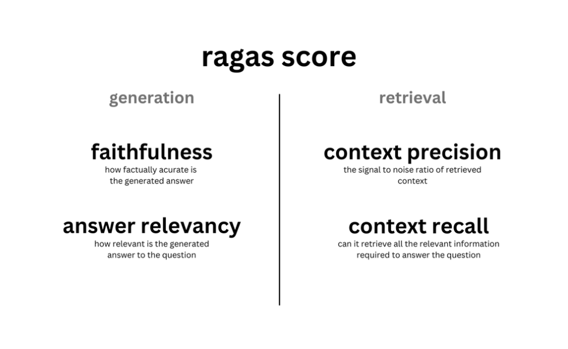

<p align="center">
  <a href="./README.md">English</a> |
  <a href="./README_CN.md">简体中文</a> |
</p>

📌 [小孔研发文档](https://xau5uwp76m.feishu.cn/docx/GqUVdjddXoo0A1xbMGOcLoUhnKe?from=from_copylink)

# KmcGPT: 智能文档处理和问答系统

RAGAS框架：

KmcGPT是一个基于最新自然语言处理技术的智能问答系统，旨在为用户提供一个高效处理和检索文档内容的平台。系统整合了文档管理、搜索引擎优化和大模型问答技术，以提升信息检索的准确性和便利性。
KmcGPT隶属于La Vie企业级大模型应用创新引擎，是第一款基于此平台开发的企业级应用，La Vie(http://119.45.114.43/tiral/#/Home)
集成了大模型库，知识湖，提示语IDE，Agent工具箱，虚拟数据源，业务语义平台，知识图谱增强，智能agent池，小模型协同和人机交互等模块，针对企业开发人员，能够快速用快速的方式开发独属于企业的，根据企业内部数据和原有平台进行系统嵌入和应用优化。

| 功能 | La Vie | Assistants API | LangChain |
| --- | --- | --- | --- |
| 编程方式 | 面向企业开发人员 | 面向 API | 面向 Python 代码 |
| 生态策略 | 封闭商用 | 封闭商用 | 开源 |
| RAG 引擎 | ✅ | ✅ | ❌ |
| Prompt IDE | ✅ | ✅ | ❌ |
| 支持的 LLMs | 丰富 | 仅 GPT | 丰富 |
| 本地部署 | ✅ | ❌ | N/A |

## 技术路线
### RAG概述

ChatGPT、GLM等生成式人工智能在文本生成、文本到图像生成等任务中表现出令人印象深刻的性能。但它们也存在固有局限性，包括产生幻觉、缺乏对生成文本的可解释性、专业领域知识理解差，以及对最新知识的了解有限。为了克服这些限制，提高模型的能力，有两种主要途径：一种是微调（Fine Tune）来更新模型，另一种是让他们能够与外部世界互动，以不同的形式和方式获取知识。

微调固然效果好，可以让模型真正的“学会”一些私域知识。但是微调也会带来几个问题：首先，由于生成模型依赖于内在知识（权重），因此模型还是无法摆脱幻觉的产生，在对理解门槛高且准确性要求严格的场景下，这就是完全无法接受的，因为用户很难从回答的表面看出模型是否是在胡说八道。其次，在真实场景中，每时每刻都在产生大量数据，对一个事物的概念会迭代的飞快，如某个政策的解读、某个指标的调整等。而模型微调并不是一个简单的工作，无论是从数据准备、算力资源、微调效果、训练时间等各个角度来看，随时用新产生的数据来进行微调都是不现实的，且最终微调的效果也无法保证，能够做到每月更新一次都已经是很理想的状态。

另一种解决方案，RAG（Retrieval Augmented Generation）为生成式模型提供了与外部世界互动提供了一个很有前景的解决方案。RAG的主要作用类似搜索引擎，找到用户提问最相关的知识或者是相关的对话历史，并结合原始提问（查询），创造信息丰富的prompt，指导模型生成准确输出。其本质上应用了情境学习（In-Context Learning）的原理。

在大型语言模型（LLM）领域，创建一个最小可行产品相对简单，但实现生产级性能和可用性是一个艰巨的任务，特别是构建高性能的RAG系统。RAG已在企业私域知识问答等领域广泛应用，例如，现在主流的各类chat to PDF，chat to doc等应用都是基于RAG来搭建的。

### RAG基本流程


如下图所示RAG可分为5个基本流程：知识文档的准备；嵌入模型嵌入模型（embedding model）；向量数据库；查询检索和生产回答：


### 后台部分
- 支持多维度文档处理，主要以PDF格式，未来将支持Word、Excel等格式。
- 使用Elasticsearch作为数据存储载体，实现文档的分类和分层级标签管理。
- 为不同用户、助手和角色实现细粒度的权限分配，确保语料库独立性和安全性。
- 提供后台管理平台，用于管理助手、文档语料库和用户权限。

### 算法部分
- 对上传的文档执行数据清洗和文本分割，分片存入Elasticsearch。
- 实施BM25索引构建和Embedding计算，与文档一同存入数据库。
- 对用户查询进行分词和词性标注，对含单一名词的查询自动补全意图。
- 根据用户选择，使用BM25或向量搜索匹配度最高的文本片段。
- 结合用户查询和匹配文本片段构建Prompt，输入大模型获取回答。
- 具体技术路线文档见飞书：https://xau5uwp76m.feishu.cn/docx/GqUVdjddXoo0A1xbMGOcLoUhnKe?from=from_copylink

### 前台部分
- 助手创建和管理界面，支持不同权限用户操作，包括文件上传和助手配置。
- 展示模型生成的回答，显示相关文本片段及其评分，支持PDF浏览和文本高亮。
- 开放性问答模式，基于知识库内容获得模型回答。

### 使用方法
- 准备好miniconda或Anaconda环境，建立一个python3.10环境
- 使用以下命令安装环境和依赖项：
- 将conda和pip都配置好清华源镜像：
- #在用户主目录（例如 /home/user/）下使用以下命令创建：

## 🚀 配置Conda镜像源

为了加快包的下载速度，我们推荐您使用清华大学的镜像源。请按照以下步骤配置您的Conda镜像源：

1. 打开或创建您的Conda配置文件`~/.condarc`：
    ```bash
    vim ~/.condarc
    ```

2. 将以下内容粘贴到`~/.condarc`文件中：
    ```yaml
    channels:
      - defaults
    show_channel_urls: true
    default_channels:
      - https://mirrors.tuna.tsinghua.edu.cn/anaconda/pkgs/main
      - https://mirrors.tuna.tsinghua.edu.cn/anaconda/pkgs/r
      - https://mirrors.tuna.tsinghua.edu.cn/anaconda/pkgs/msys2
    custom_channels:
      conda-forge: https://mirrors.tuna.tsinghua.edu.cn/anaconda/cloud
      msys2: https://mirrors.tuna.tsinghua.edu.cn/anaconda/cloud
      bioconda: https://mirrors.tuna.tsinghua.edu.cn/anaconda/cloud
      menpo: https://mirrors.tuna.tsinghua.edu.cn/anaconda/cloud
      pytorch: https://mirrors.tuna.tsinghua.edu.cn/anaconda/cloud
      pytorch-lts: https://mirrors.tuna.tsinghua.edu.cn/anaconda/cloud
      simpleitk: https://mirrors.tuna.tsinghua.edu.cn/anaconda/cloud
    ```

3. 同样配置您的pip镜像源：
    ```bash
    mkdir -p ~/.pip 
    vim ~/.pip/pip.conf
    ```
    然后添加以下内容：
    ```ini
    [global]
    index-url = https://mirrors.aliyun.com/pypi/simple/
    [install]
    trusted-host = mirrors.aliyun.com
    ```

4. 创建Conda环境并安装必要的软件包：
    ```bash
    ~/miniconda3/bin/conda create -n kmccode_env python=3.10
    git clone -b production https://github.com/StickPromise/KMC.git . #克隆仓库的production分支：
    cd KMC.config
    while read requirement; do conda install --yes $requirement || pip install $requirement; done < requirements.txt
    pip install pdf2text
    sudo apt install -y libpoppler-cpp-dev
    pip install pdftotext
    pip install elasticsearch
    ```

5. 如果遇到文件夹无权限，先查看权限然后赋予权限，例如：
    ```bash
    ls -ld /home/user/work/kmc/
    chmod u+w /home/user/work/kmc/
    ```


这些步骤将帮助您快速配置开发环境并开始使用KmcGPT。🌟


## 🛠️ 更改本机部署配置

1.上传小模型到仓库目录下
2.进入config.json文件中修改production标签的配置信息：
```bash
"production": {
    "elasticsearch": {
        "hosts": "http://127.0.0.1:9200/",
        "basic_auth_username": "elastic",
        "basic_auth_password": "XXX"
    },
    "log_file": "myapp.log",
    "model_path": "/model/bge_large_zh/", #更改为本地的小模型地址
    "spacy_model": "/model/zh_core_web_sm/zh_core_web_sm-3.5.0/", #更改为本地的小模型地址
    "history_api_url": "XXX",
    "stopwords": "/config/stopwords.txt",
    "secret_token": "XXX",
    "chatgpt_api": "XXX",
    "external_api": {
        "llm_ans": "XXX",
        "backend_notify": "http://127.0.0.1/sync/syncCallback"
    },
    "file_storage_path": "/config/file_storage/",
    "record_path": "/config/QA_record.json"
}
```

3.对于每一个类的kmc_XX.py文件，进入之后修改sys.path.append("E:\\工作\\KmcGPT\\KmcGPT")
  特别对于config类，修改根目录和stopwords的路径，predefinedqa的路径


## 支持和反馈

有问题？请通过[Issues](https://github.com/StickPromise/KmcGPT/issues)跟我们联系。
 - [微信]() 👉：扫描下方二维码，添加微信好友，备注 kmc，我们将邀请您加入 kmc 社区。  


## 🧩评估Pipline

对于RAG产品的评估工作，首先要了解它的评估指标和工作过程：

1.忠实度（Faithfulness）：衡量生成答案与提供的上下文之间的事实准确性。这一过程分为两步。首先，针对给定的问题和生成的答案，Ragas使用大型语言模型（LLM）来确定生成答案所做出的陈述，得到一个需要核实真实性的陈述列表。第二步，给定这些陈述和返回的上下文，Ragas使用LLM来检查这些陈述是否得到上下文的支持。通过将正确陈述的数量与生成答案中的陈述总数相除来得到特定示例的分数。

2.答案相关性（Answer Relevancy）：衡量答案与问题的相关性和针对性。对于给定的生成答案，Ragas使用LLM来找出可能的问题，即生成答案可能作为回答的问题，并计算与实际提出的问题的相似度。

3.上下文相关性（Context Relevancy）：衡量检索到的上下文中的信噪比。对于一个给定的问题，Ragas调用LLM来识别出用于回答问题所需的上下文中的句子。所需句子与上下文中总句子的比例即为评分。

4.上下文召回（Context Recall）：衡量检索器获取回答问题所需全部信息的能力。Ragas通过提供的真实答案来计算这一指标，使用LLM检查其中的每个陈述是否能在检索到的上下文中找到。如果找不到，说明检索器未能检索到支持该陈述的所需信息。



本模块旨在通过构建和评估一套问答数据集，主要侧重于评估忠实度（Faithfulness）和答案相关性（Answer Relevancy）。深入了解和提升RAG（Retrieval-Augmented Generation）产品的性能。我们精心设计了一个多维度的数据集，包括中文、英文、文中有答案、文中无答案、表格中信息和图片中信息等类别。每个类别都包含了问题、答案以及来源文本，所有数据以Excel文件格式编写，并转换为JSON格式以便于模型读取和处理。

**数据集分类**
中文: 专注于中文文本的问题和答案。

英文: 专注于英文文本的问题和答案。

文中有答案: 源文本中直接包含答案。

文中无答案: 源文本中不直接包含答案，需要推理。

表格中信息: 答案位于表格数据中。

图片中信息: 答案来自图片内容的解读。

PS.🍻对于问题，尽可能地补充同一个问题的不同问法和不同问题的相似问法

### 📝数据集示例

以下是数据集的一个示例，以便于理解其结构和内容：

| 问题                         | 答案  | 类别               | 来源文本                                             |
| -------------------------- | ----- | ------------------ | ---------------------------------------------------- |
| 北京故宫的建成年份是什么时候？ | 1420年 | 中文、文中有答案 | 北京故宫，又称紫禁城，是中国明清两代的皇宫，始建于明成祖永乐四年，即1420年。 |

### 数据集格式

数据以以下格式编排并存储：

- **问题**：具体的询问内容。
- **答案**：问题的确切答案。
- **类别**：如中文、英文、文中有答案等。
- **来源文本**：包含答案的原始文本或信息源。

数据首先以Excel文件形式编排，然后转换为JSON格式，以便自动化脚本和模型高效读取处理。

**测评标准**
测评过程侧重于两个主要方面：

    1.文本检索的准确度：评估模型检索相关文本的能力。
    
    2.基于文本的回答准确度：评估模型根据检索到的文本提供答案的准确度。
    
**测试流程**
问答生成：

使用GPT模型对问题进行问答，将生成的答案与数据集中的标准答案进行比较。如：

    “这是答案：xxx；这是回答：xxx。对回答是否与答案一致打分，分数在1-10之间。”
    
评分标准：

模型回答的评分范围为1到10分，超过7分认为回答正确，否则视为错误。

深度检验：

对于回答正确的部分，直接进入下一个问题的测评。

对于回答错误的部分，进一步分析问题来源：

检索文本匹配：

使用BM25算法比较源文本与数据集中的文本，如果匹配度超过设定阈值，则认为是模型推理的问题。
优化和调整：

若匹配度低于阈值，问题出在检索算法上，需要对检索机制进行优化。

通过这种方式，我们可以细致地评估RAG产品的性能，并根据测试结果对模型进行针对性的优化和改进。
## 致谢

感谢所有为KmcGPT做出贡献的开发者和支持者！
